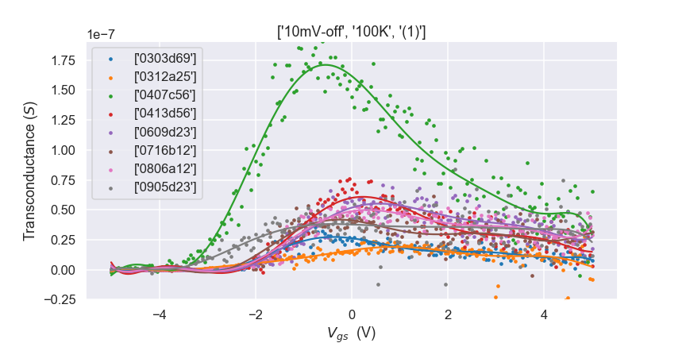

# Transfer Curve Analysis

### Author: Kenton Kwok (Imperial College London) , at the Department of Materials Science and Engineering at the City University of Hong Kong, 2020.

This Jupyter notebook is meant to be read as a supporting document for the Nanowire analysis package, written in Python.

> This project was a good opportunity to practice using some common libraries in Data Science (SciPy, Matplotlib, Pandas, Seaborn).

# Work description

### Problem statement

Provided a csv file each of four transfer curves of a set of nanowires at a range of temperatures, perform statistics and data analysis on the entire dataset. A versatile program that allows the analysis of a range of different aspects of the experiment.

Each device has a device name and multiple trials are performed on the device, each to get four transfer curves (on and off at two potential difference values).

The preprocessing flow was (done by `cleanse.py`)

-   to parse each device's transfer curve data `measured = ['Vgs', 'Ids']` by opening and reading CSVs
-   to split the transfer curve data into four segments (measurement device flattens the array). This current set up assumes the data is in the order `curvenames = ['10mV-on', '10mV-off', '30mV-on','30mV-off']`, as specified in `cleanse.py`.
-   to repeat this process over a set of temperatures in multiple directories (thus the naming of directories is important e.g. `xxxx_80K` where `80K` is the temperature)
-   to store each set of data in a meaningful format with suitable headers

To analyse data in a versatile and customisable manner, we had to allow for variations in the groupings of what data to present in each graph, thus we had

-   to allow for the filtering of data
-   to output transfer curve plots (line plot)
-   to calculate the transconductance (derivative) of the curves, apply a polynomial fit (9th order) and find its maximum
-   to output suitable histograms and distribution plots

This was done by `analys.py` and `analyspars.py`

There were a few iterations of this project, the first being solely based on SciPy, which was capable of analysing multiple devices at one ambient condition. The later iterations explored using JSONs to store and index the data, which was unsuccessful. The use of pandas triumphed because of its _versatility_ in the form of indexing and its ability to deal with _missing data_.

* * *

## Use Guide: Analysis of transfer curves and parameters

The analysis suite is capable of filtering what data to show in our plots and how many and what different plots to show. The suite gives suitable titles and labels based on what is and is not **common to all the data**.

Running the file `main.py` not only saves the plotted graphs to `/figures` but also exports the raw data and processed data into a csv in `/output`.

## Settings Examples and Outputs

### 1. Batch Plot Transfer curves

This demonstrates the capability of the program to plot a large number of graphs at once. We want to plot a number of curves, grouped first by temperature, then their device, and split by trial.

Settings file:

    temperatures = ['80K', '100K', '150K']
    devices = ['0303d69', ]
    trials = ['(1)']
    experiments = ['all']

    filters = [temperatures, devices, trials, experiments]

    order = ['temperatures', 'devices', 'trials', 'experiments']
    split = 'trials'

Output:
  
  
  
  
  
  

### 2. Comparing transfer curves at different temperatures

Good for comparison and gives a visual indication of each how the shape of the curves vary over temperatures.

Settings file:

    temperatures = ['all']
    devices = ['0303d69']
    trials = ['(1)']
    experiments = ['10mV-off']

    filters = [temperatures, devices, trials, experiments]

    order = ['temperatures', 'devices', 'trials', 'experiments']
    split = 'temperatures'

Output:
  

### 3. Comparing different device's performances

Settings file:

    temperatures = ['80K']
    devices = ['0303d69', '0312a25']
    trials = ['all']
    experiments = ['10mV-off']

    filters = [temperatures, devices, trials, experiments]

    order = ['devices', 'temperatures', 'trials', 'experiments']
    split = 'devices'

Output:
  

### 4. Comparing transconductances and their fits
The transconductances were obtained by taking the first order derivative of each transfer curve. As the scatter is large, a 9th order polynomial fit was applied to allow better visualisation of the trend. The degree of the polynomial can be changed by modifying `degree` inside the settings file.

Settings file:

    temperatures = ['all']
    devices = ['all']
    trials = ['(1)']
    experiments = ['10mV-off']

    filters = [temperatures, devices, trials, experiments]

    order = ['temperatures', 'devices', 'trials', 'experiments']
    split = 'devices'

Output:
  
  
  
  
  
  

### 5. Interpreting histograms and the swarm plot

Settings file (Same as 4):

    temperatures = ['all']
    devices = ['all']
    trials = ['(1)']
    experiments = ['10mV-off']

    filters = [temperatures, devices, trials, experiments]

    order = ['temperatures', 'devices', 'trials', 'experiments']
    split = 'devices'

Outputs:

This is a histogram of the distribution of on-off ratios at particular temperatures. The graph takes into account of the same data that was filtered in a particular settings file.
  

The two following figures are swarm plots of the on off ratios and maximum transconductances of each device.   
  
  
